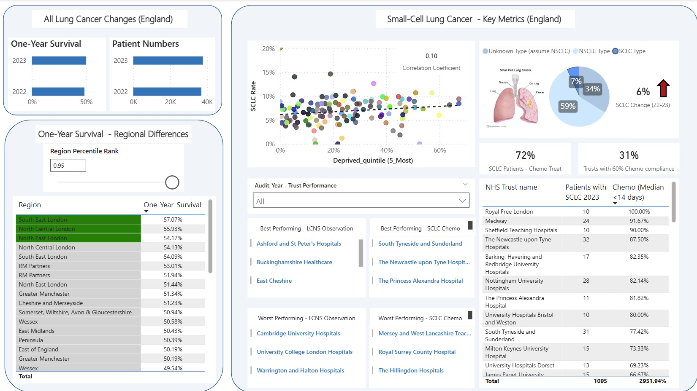
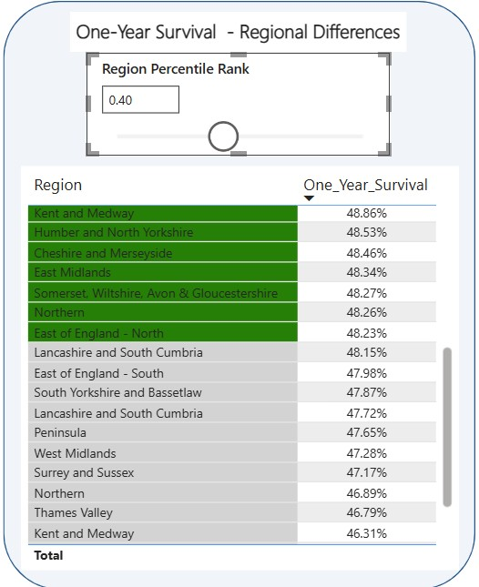

# Accounts Receivable Database

By John Haidoulis

## General Summary

Lung Cancer (small-cell lung cancer type) England (2024-2025) Report.

## Scope

* Report for NHS practitioners and Trusts on Lung Cancer Metrics in England.
The report constitutes a combination of 2024 and 2025 Lung Cancer data from the National Lung Cancer Audi State of theNation Report 2025
* A distinct report is publicly available for each year with broad trends described. However some metrics (including some new ones in 2025 such as the deprivation index) were not included in these reports.
* I set out to supplement the report with additional information: To compare regional NHS trust differences in one-year survival, deprivation correlation, nurse specialist observations (LCNS), and to provide more detail on an infrequent yet fast progressing cancer (SCLC type) cancer changes. 
* The data for the 2024 and 2025 spreadsheets was recorded in 2022 and 2023, respectively.

## Report and Insights

* The data from both years was processed, appended, and semantic models were prepared for data that was common between years.

* Considering there was a similar increase in the overall number of patients between 2022 and 2023 there was a similar one-year survival increase. Tooltips were added for each graph to display the percentage change.
* NHS regions were ranked by lung cancer one-year surival; London hospitals provided the highest One year survival rate. A slider is provided to adjust the rank to compare the percentile position of specific regions.

### SCLC cancer type 
* SCLC rates have increased by 6% from 2022 to 2023. Despite accounting for less than 15% of lung cancer cases worldwide, SCLC cancer is a fast progressing and late presenting type of cancer. This information wasn't displayed in the official report so I thought I would delve into it here. 
* Only 72% of patients with this type of cancer received chemotherapy treatment. An arbitrary threshold was decided for trusts to start chemotherapy for 60% of patients within a 2 week waiting period. Importantly only 31% of Trusts met this threshold. Within some Trusts, some patients were never seen within this 2 weeks period. There is a need for 69% of NHS Trusts to improve waiting times for critical SCLC treatment aggressive cancer.
* There was no correlation between the highest deprived quintile and SCLC rates between regions.
* With a year slicer for the user, both the best and worst practices in terms of SCLC chemotherapy and LCNS observation percentages are displayed for comparison of the different Trusts.

## Limitations

* The report would improve and explain regional differences with regional funding information (Outside scope of report)
* Additional data from 2021 and earlier to allow me to better compare trends. This data was not accessible.
* Additional raw data from each practice is necessary to make predictive models, rather only one total number and percentage for each factor was published. 

## References:

* Data was downloaded from the National Lung Cancer Audi State of the Nation Report 2025 & 2024. (https://www.data.gov.uk/dataset/40fd7847-4726-41ad-a9f1-46b62469533a/national-lung-cancer-audit-state-of-the-nation-report-2025, https://www.data.gov.uk/dataset/62939921-8557-4f6e-a5c7-b34d46471619/national-lung-cancer-audit-state-of-the-nation-report-2024)
* Contains public sector information licensed under the Open Government Licence v3.0. https://www.nationalarchives.gov.uk/doc/open-government-licence/version/3/

* SCLC cancer image was copied from Cleveland Clinic webpage.

